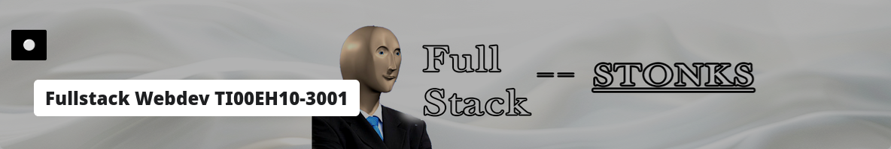

# Fullstack Webdev Course - 2024

Some files for the inagural fullstack course of 2024.

 

## Running Dotnet

[Get started with dotnet - Microsoft](https://learn.microsoft.com/en-us/aspnet/core/tutorials/first-mvc-app/start-mvc?view=aspnetcore-8.0&tabs=visual-studio-code) 

- Install dotnet sdk
```bash
# opensuse tumbleweed
sudo zypper install opi
opi install dotnet
# windows
winget install dotnet-runtime-8
winget install dotnet-sdk-8
```

- Create a new mvc project
```bash
# create a new mvc project into a folder called exampleapp
dotnet new mvc -o exampleapp
```

- Enable ssh
```bash
dotnet dev-certs https --trust
```

- Run the project
```bash
dotnet run
# or
dotnet watch
```

## Snippets

- New view file (cshtml)

```html
@model workorder.Models.WorkOrderViewModel
@{
  ViewData["Title"] = "Work Order page";
}

<h1>Hello from @ViewData["Title"]</h1>
<p>Lorem ipsum dolor sit amet, qui minim labore adipisicing minim sint cillum sint consectetur cupidatat.</p>
```

- New class file

```csharp
namespace projectname.path.to.folder
{
	public static class ClassName
    {
        public static void MethodName()
        {
            // code here
        }
    }
}
```

- new controller file

```csharp
using Microsoft.AspNetCore.Mvc;

namespace workorder.Controllers
{
    public class ExampleController : Controller
    {
        [HttpGet]
        public IActionResult Index()
        {
            return View();
        }
        [HttpGet]
        [Route("test")]
        public IActionResult DifferentExample(string message)
        {
            return View(message ?? "No message given");
        }
    }
}
```
